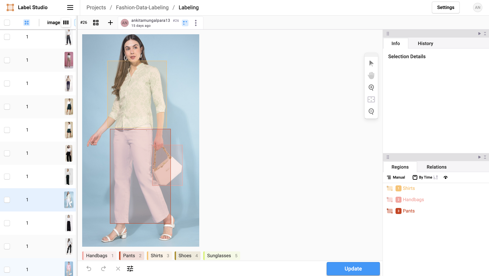
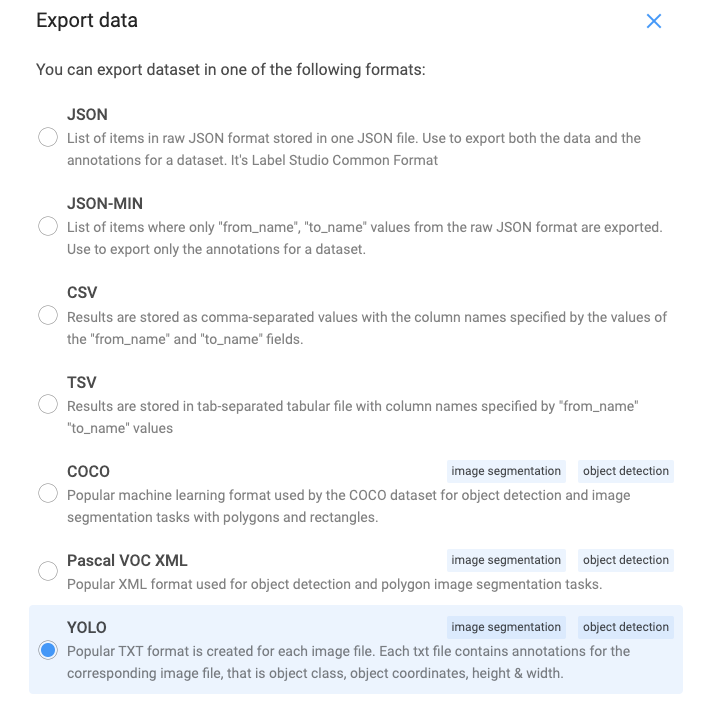
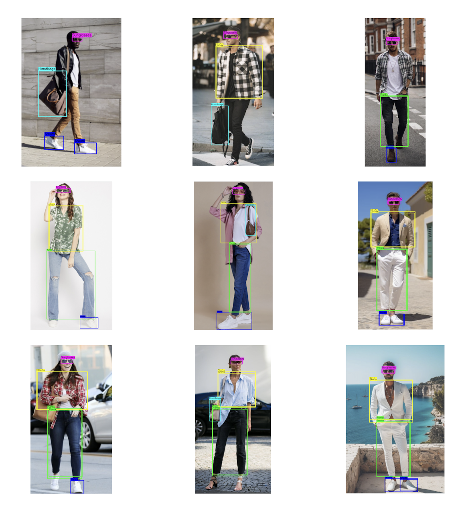

[](https://github.com/AnkitaMungalpara/YOLOv5-Custom-Object-Detection/build/main/YOLO_object_detection.ipynb)

# YOLOv5 Custom Object Detection 

This project focuses on training a custom YOLOv5 model to detect specific clothing accessories, including shirts, pants, shoes, handbags, and sunglasses. The project involves data annotation, model training, and running inference on new images to identify and classify these objects.

## Project Directory Structure

```bash
.
├── Annotated_Data
│   ├── images
│   ├── labels
│   ├── data.yaml
│   └── pinterest.yaml
├── Product
│   ├── Shirts
│   ├── Pants
│   ├── Shoes
│   ├── Handbags
│   └── Sunglasses
├── weights
│   ├── best.pt
│   └── best.onnx
├── YOLO_object_detection.ipynb
├── README.md
└── requirements.txt

```

## Requirements

- Python 3.8 or higher
- PyTorch
- OpenCV
- Label Studio (for data annotation)
- YOLOv5 repository by Ultralytics

Install the necessary Python packages using:

```bash
pip install -r requirements.txt
```

## Steps to Run

### 1. Data Collection

The first step in this project was collecting a dataset of images to train the model. We scraped Pinterest to gather a dataset containing 100 images for each class. The classes of interest for this project are:

- `Shirts`
- `Pants`
- `Shoes`
- `Handbags`
- `Sunglasses`

These images are stored in the `Product/` directory.

### 2. Data Annotation

After collecting the data, the next step is to annotate the images using a tool like [Label Studio](https://labelstud.io/). This process involves drawing bounding boxes around the target objects and assigning the appropriate labels.

Each bounding box is stored in the YOLOv5 format, with normalized values for the center coordinates, width, and height.

#### **Annotation Process Demonstration**


Below is a demo image that shows the data annotation process using Label Studio. This image guides you through drawing bounding boxes and assigning labels:



*Click on the image above to see how to do annotation.*

#### **Exporting Annotations in YOLO Format**

Once you have completed the annotations, you can export them in YOLO format. If you’re using Label Studio or a similar tool, exporting annotations in the required format is straightforward.

Here’s an image demonstrating how you can export the annotations in YOLO format from Label Studio:





### 3. Training the YOLOv5 Model

The YOLOv5 model is trained using the annotated dataset. YOLOv5 provides five pre-defined models (nano, small, medium, large, and extra-large) to choose from, depending on your needs.

To train the YOLOv5 model, follow the steps outlined in the [YOLOv5 documentation](https://colab.research.google.com/github/ultralytics/yolov5/blob/master/tutorial.ipynb#scrollTo=ZY2VXXXu74w5). Customize the `.yaml` file to include your classes and dataset paths:

```yaml
# Number of classes
nc: 5

# Names of the classes
names: ['Handbags', 'Pants', 'Shirts', 'Shoes', 'Sunglasses']

# Paths to the datasets
path: /content/Annotated_Data                # dataset root dir
train: /content/Annotated_Data/images/train  # train images (relative to 'path') 450 images
val: /content/Annotated_Data/images/val      # val images (relative to 'path') 50 images
test:                                        # test images (optional)

# Classes
names:
  0: Handbags
  1: Pants
  2: Shirts
  3: Shoes
  4: Sunglasses
```

After training, the weights will be saved in the `weights/` directory.

### 4. Running Inference

Use the trained YOLOv5 model to run inference on test images. The model accurately detected and classified the clothing accessories in new images.

For inference, we use the OpenCV-DNN module. OpenCV-DNN provides a fast and efficient way to run YOLOv5 models. To get started with OpenCV-DNN, check out the [official documentation](https://learnopencv.com/object-detection-using-yolov5-and-opencv-dnn-in-c-and-python/).


### 5. Visualizing Results

After running inference, we can visualize the results by displaying the images with detected bounding boxes and labels. This allows us to verify the model's performance in correctly identifying the clothing accessories.

Here is an example of the inference results:



